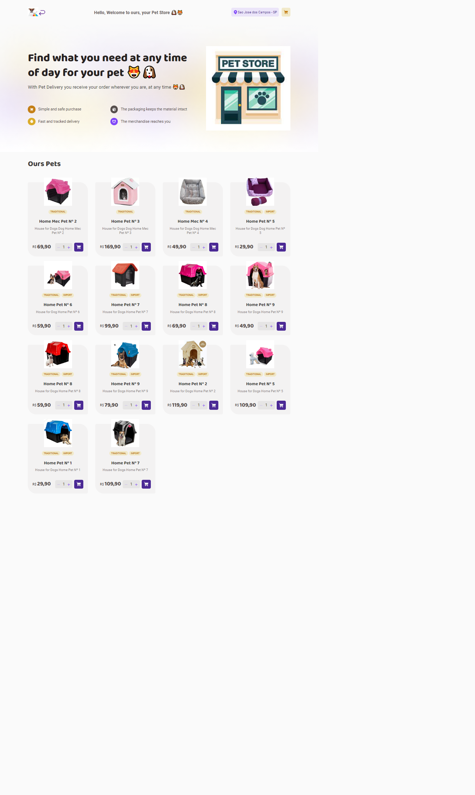
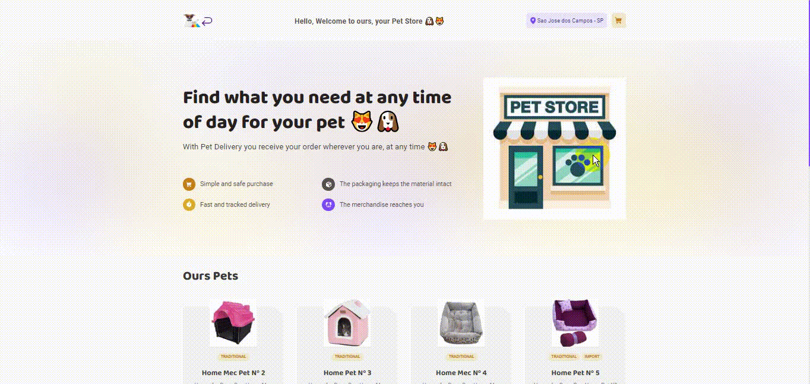
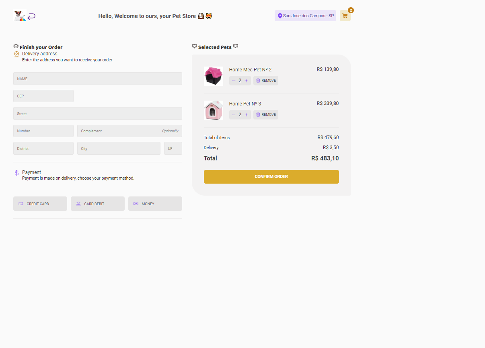
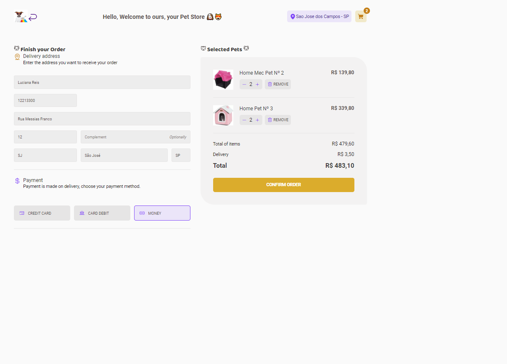
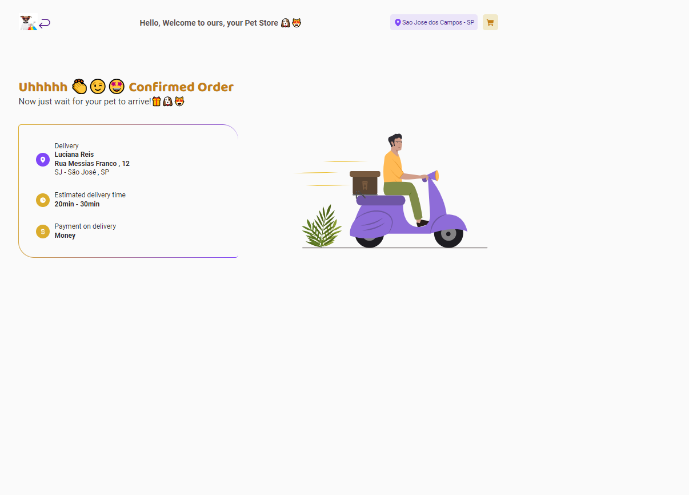

<h1 align="center">🐶😻 Pet Delivery 🐾</h1>

<div align="center">
 
</div>

<h3 align="center">A Pet delivery website developed with React + Typescript, Rocketseat learnings.</h3>

---

<h3>Demonstration 🎥</h3>

_<h4>Tour of the Project 💻</h4>_



_<h3>Adding and removing Pets from the cart, home page 😻🐶 🛒</h3>_


_<h3>Completing Orders with data 📦🛒</h3>_



_<h3>Completing Orders with data 📦🛒</h3>_



_<h3>Purchase history in cart 📄🛒</h3>_



<br>

---


## :rocket: User stories
- User can add products into the cart;
- User can increase and decrease product quantity into the cart;
- User can access the cart;


## :rocket: Functionalities
- Cart info is stored in the localStorage;
- After the cart contains the product, user can only increase its quantity;

---

## 🛠 Tecnologias | Tecnologias
#### The following tools were used in building the project

- [Next](https://nextjs.org/)
- [Axios](https://axios-http.com/)
- [TypeScript](https://styled-components.com/)
- [Stripe](https://dashboard.stripe.com/)
- [Redux](https://redux.js.org/)
- [Zod](https://zod.dev/)
- [Tailwind](https://tailwindcss.com/)
- [React-hook-Form](https://react-hook-form.com/)
- [MapQuest](https://developer.mapquest.com/)
- [React Router Dom](https://www.npmjs.com/package/react-router-dom)

<div style="display: inline_block"><br>
  
  
  
  
 </div>

<br>

---

<h2>But, what did I learn? 🤩</h2>

<br>

- I learned to use `reducers` to handle more complex states
- I learned how to use `React Hook Form and Zod` for forms
- I learned how to create `auxiliary variables` to make the `cleaner and more readable code`

<br>

---

##  How to use

1. Download/clone the project ```git clone https://github.com/ludiemert/Pet_Delivery.git```

2. Run the command to download the dependencies of the ```npm instal``` project

3. I created a file at the root of the project with the name <strong>.env.local</strong> and put your environment variables in it following the example of the file <strong> .env.example</strong>

4. Run the project using the command ```npm run dev```

---

## 📝 Licença

Esse projeto está sob a licença MIT. Veja o arquivo [LICENSE](LICENSE) para mais detalhes.

---


## ✒️ Authors

 * **Rocketseat**

- ## My LinkedIn - [](https://www.linkedin.com/in/lucianadiemert/)


### Contact


### [**Luciana Diemert**](https://github.com/ludiemert)

🛠 `Front-end` `Back-end`Developer Jr. <br>
📍 São Jose dos Campos – SP - Brazil

<a href="https://www.linkedin.com/in/lucianadiemert" target="_blank"></a>&nbsp;
<a href="mailto:lucianadiemert@gmail.com" target="_blank"></a>&nbsp;
<a href="#"></a>&nbsp;
<a href="https://www.github.com/ludiemert" target="_blank"></a>&nbsp;

<br clear="left"/>


